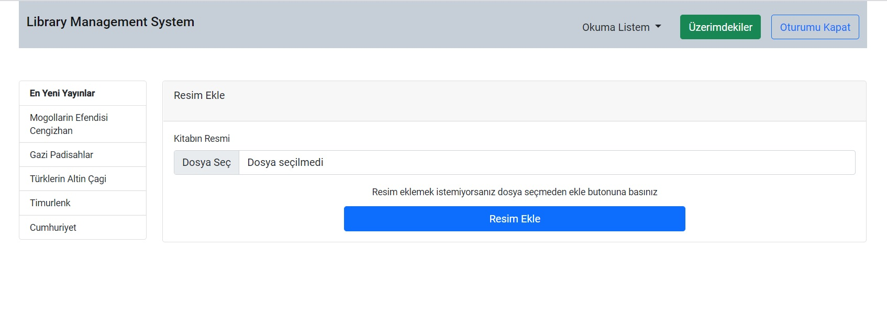

# LibraryProject

This project codes are backend code of [Library Management System](https://github.com/VonHumbolt/LibraryManagementSystem) and
it was generated with [Angular CLI](https://github.com/angular/angular-cli) version 11.2.3.

## Usage
The project UI is divided into two section as user and admin. User can register and login in library system. Thus, users who are registered in system can borrow books. Admins lend books to users. Only admins can add a new book and delete books. 

####  <li> User Appearance </li>
All books in the library are listed in this page.

 
  

####  <li> Admin Appearance </li>

  

#### <li> Users can search for books by filtering by book name, author, category and publisher </li>

  

#### <li> Book Detail Page </li>
Users can see full information of book and book image in this page. If book is borrowed by another user, user see return date of book.
Also, users can add book into reading list to save book and reading another time.

   |
  

#### <li> Lending Page For Admin </li>
This page is only visible for admins. Borrowing and lending process is done here. The administrator checks by user's email 
whether the user is a member of library. If user is a member of library, all the borrowed books are displayed. 
The admin can lend the book which is selected by users to user, takes the book back or extend return date of book in this panel.

   

#### <li> User's Book </li>
Books that is borrowed by user are listed here. The return date of book and remaining day are showed user. User only once can extend the 
return date of book byself.

   

#### <li> The Administrator can add book and book image</li>

   

## Development server

Run `ng serve` for a dev server. Navigate to `http://localhost:4200/`. The app will automatically reload if you change any of the source files.

## Code scaffolding

Run `ng generate component component-name` to generate a new component. You can also use `ng generate directive|pipe|service|class|guard|interface|enum|module`.

## Build

Run `ng build` to build the project. The build artifacts will be stored in the `dist/` directory. Use the `--prod` flag for a production build.

## Running unit tests

Run `ng test` to execute the unit tests via [Karma](https://karma-runner.github.io).

## Running end-to-end tests

Run `ng e2e` to execute the end-to-end tests via [Protractor](http://www.protractortest.org/).

## Further help

To get more help on the Angular CLI use `ng help` or go check out the [Angular CLI Overview and Command Reference](https://angular.io/cli) page.

## Contact
Email -> kaankaplan@icloud.com
